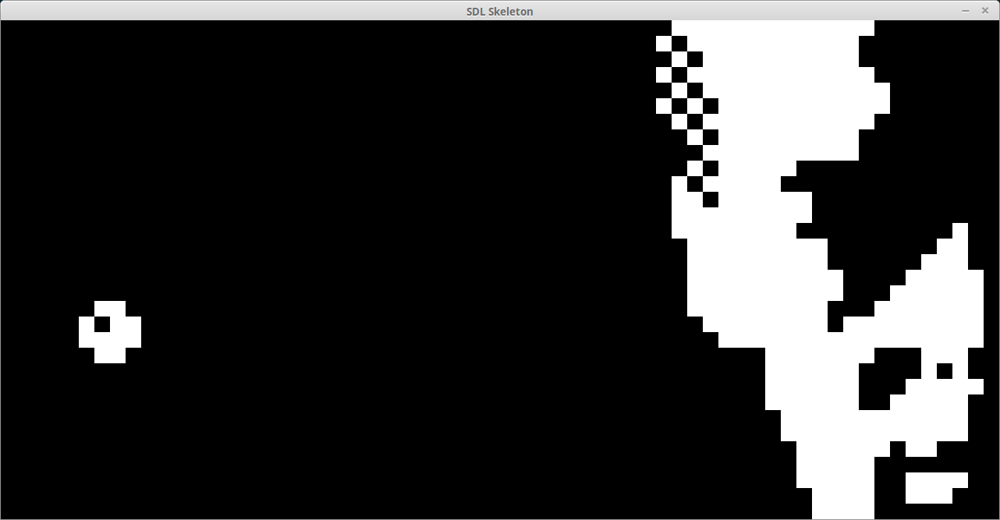

# Chip-8 Interpreter implemented in Nim




### Not implemented
- input (keyboard)
- sound
- timers (delay, sound)

## Dependencies
- nim (compiler)
- sdl2

To build:
```
nim c emulate.nim
```

To run:
```
emulate <romfile>
```
