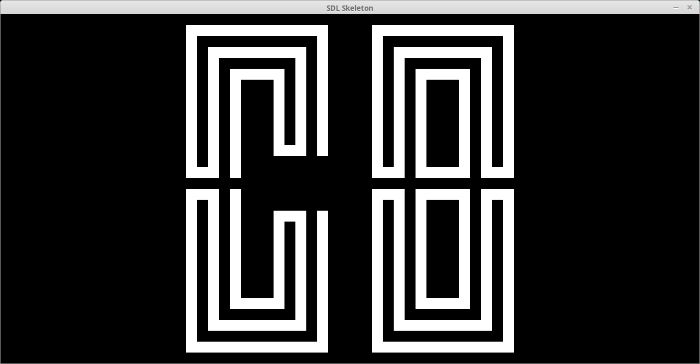

# Chip-8 Interpreter implemented in Nim

<<<<<<< HEAD

### Not implemented
- input (keyboard)
- sound
- timers (delay, sound)
- carry flag (VF)
- ??

=======


Input (keyboard) and sound are not implemented.
>>>>>>> 76cc59279c6d80646d0119643c96e7a64e738ed2

## Dependencies
- nim (compiler)
- sdl2

To build:
```
nim c emulate.nim
```

To run:
```
emulate <romfile>
```
